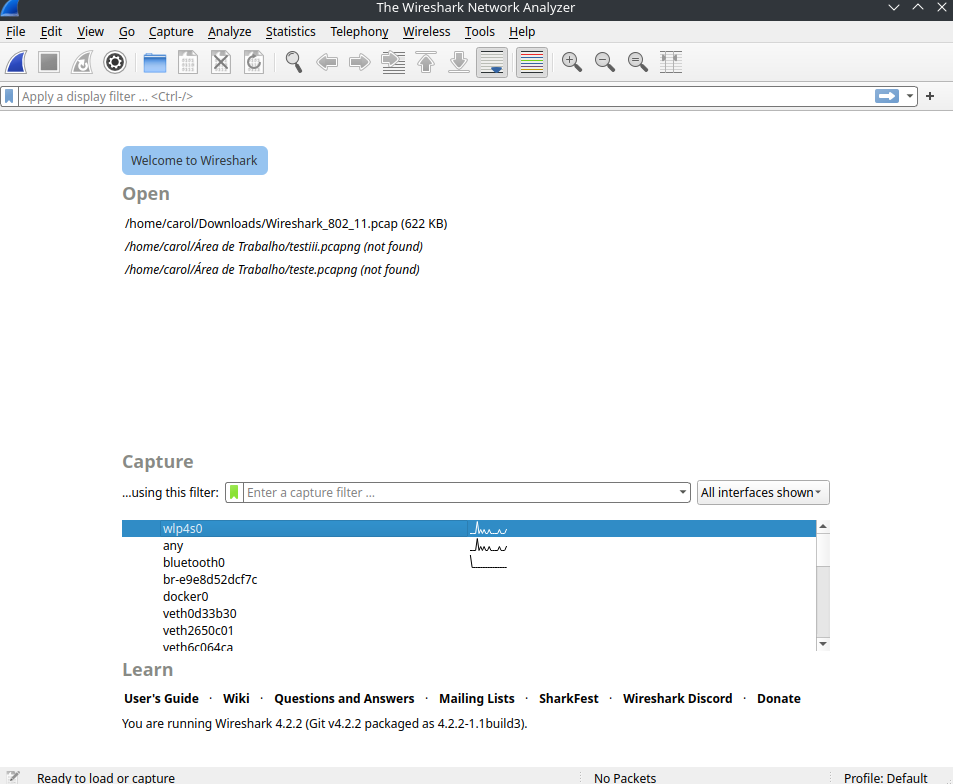

# Relatório de Laboratório: Qualidade de Serviço (QoS) - A Otimização da Jornada dos Pacotes

**Disciplina:** Redes de Computadores II

**Professora:** Angelita Rettore de Araujo

**Nome do Aluno:** Carolina de Oliveira das Chagas

**Turma:** 2023

---

## 1. Introdução

Este laboratório aborda a **Qualidade de Serviço (QoS)**, um conjunto de mecanismos importantes para gerenciar o tráfego de rede e assegurar que aplicações críticas recebam tratamento preferencial. Diferente dos laboratórios anteriores que focaram na confiabilidade (garantir que os pacotes cheguem), o objetivo aqui é garantir que os pacotes cheguem *com qualidade* – ou seja, com a latência, jitter, throughput e perda de pacotes adequados.

A importância da QoS é contextualizada pela **narrativa da telecirurgia**, onde cada pacote de comando tátil, voz ou dado vital do paciente é crucial. Atrasos, variações irregulares na chegada ou perda de pacotes podem ter consequências catastróficas.

## 2. Objetivos

Os principais objetivos deste laboratório são:
1.  **Compreender e medir** os conceitos fundamentais de Latência, Jitter, Throughput, Perda de Pacotes e Classificação de Tráfego no contexto de QoS.
2.  **Configurar e executar simulações** no **Network Simulator 2 (NS2)** para observar o comportamento da rede sob diferentes condições de QoS.
3.  **Utilizar o Wireshark** para capturar e analisar o tráfego de rede, medindo parâmetros de QoS em tempo real.
4.  **Analisar o impacto** da variação dos parâmetros de QoS no desempenho de diferentes tipos de aplicações.
5.  **Comparar a tolerância a perdas e a sensibilidade à latência e jitter** de diversas aplicações.
6.  **Propor soluções** baseadas em QoS para otimizar o desempenho de aplicações críticas em cenários de rede desafiadores.

## 3. Ferramentas Utilizadas

*   **Network Simulator 2 (NS2)**: Ambiente de simulação de rede para modelar cenários.
*   **Wireshark**: Analisador de protocolo de rede para captura e inspeção de pacotes em tempo real.
*   **Acesso à Internet**: Para testes com ferramentas online (como Google Meet).

---

## 4. Parte I: Relembrando a Jornada – Preparando o Ambiente

**Contexto Teórico:** A narrativa da cirurgia remota é a base para entender a importância dos "pacotes heróis" (Pablo, Melody, Flash e Data) e como a QoS é vital para a missão deles de salvar uma vida.

### **4.1. Verificação e Configuração Inicial do NS2**

*   Confirmei a instalação do NS2 e criei o arquivo `qos_base.tcl`.

**Entrega:** Captura de tela do `qos_base.tcl` no editor de texto.

# 

### **4.2. Configuração Inicial do Wireshark**

*   Abri o Wireshark e selecionei a interface de rede correta para captura.

**Entrega:** Captura de tela do Wireshark com a interface de captura selecionada.

# 

# 

---

## 5. Parte II: Latência (Delay) – O Tempo é Essencial

**Contexto Teórico:** A latência é o tempo que um pacote leva para ir da origem ao destino, como o tempo para o comando tátil do Dr. Martinez (Flash) chegar ao bisturi em Manaus.

### **5.1. Simulação de Latência no NS2**

*   Criei e executei o script `lab_latencia.tcl`, experimentando diferentes valores para `link_delay` (ex: 10ms, 100ms, 500ms).

**Entrega:** O código `lab_latencia.tcl` utilizado.
```tcl
# lab_latencia.tcl
# Simulação de Latência (Delay)

# 1. Importação do Arquivo Base
source qos_base.tcl

# 2. Criação dos Nós
set n0 [$ns node]
set n1 [$ns node]

# 3. Criação do Link com Latência Variável
# Experimente diferentes valores para o delay (ex: 10ms, 100ms, 500ms)
#set link_delay "100ms" ;# Latência do link - Tempo final da simulação: 4.658
#set link_delay "10ms" ;# Latência do link - Tempo final da simulação: 4.568
set link_delay "500ms"  ;# Latência do link - Tempo final da simulação: 5.048
create_link $n0 $n1 $default_bw $link_delay $default_queue

# 4. Criação dos Agentes e Aplicações
set udp0 [new Agent/UDP]
$ns attach-agent $n0 $udp0

set cbr0 [new Application/Traffic/CBR]
$cbr0 attach-agent $udp0
$cbr0 set packetSize_ 1000
$cbr0 set interval_ 0.01 ;# 100 pacotes/segundo

set null0 [new Agent/Null]
$ns attach-agent $n1 $null0
$udp0 set class_ 0 ;# Para identificação no trace

$ns connect $udp0 $null0

# 5. Agendamento de Eventos
$ns at 0.5 "$cbr0 start"  ;#começa a enviar os pacotes do 0 ao 1
$ns at 4.5 "$cbr0 stop"  ; #para de enviar pacotes do 0 ao 1
$ns at 5.0 "finish"      ; #finaliza a simulação que ocorre em mais ou menos 4.658 de acordo com a execução no NAM com latência de 100ms

# 6. Início da Simulação
$ns run
```

### **5.2. Análise da Latência no Arquivo de Trace (.tr)**

*   Analisei o arquivo `lab_latencia.tr`, identificando o envio e recebimento de pacotes para calcular a latência de ponta a ponta.

**Entrega:** Trecho do arquivo `.tr` destacando um pacote enviado e seu respectivo recebimento.

Abaixo, trecho com Latência de 10 ms entre um envio e seu respectivo recebimento
```
    + 0.51 0 1 cbr 1000 ------- 0 0.0 1.0 1 1
    r 0.528 0 1 cbr 1000 ------- 0 0.0 1.0 1 1
```

Abaixo, trecho com Latência de 100 ms entre um envio e seu respectivo recebimento
```
    + 0.53 0 1 cbr 1000 ------- 0 0.0 1.0 3 3
    r 0.638 0 1 cbr 1000 ------- 0 0.0 1.0 3 3
```

Abaixo, trecho com Latência de 500 ms entre um envio e seu respectivo recebimento
```
    + 0.52 0 1 cbr 1000 ------- 0 0.0 1.0 2 2
    r 1.028 0 1 cbr 1000 ------- 0 0.0 1.0 2 2
```


**Cálculos da Latência:**

| `link_delay` Configurado | Timestamp Envio | Timestamp Recebimento | Latência Calculada |
| :----------------------- | :-------------- | :-------------------- | :----------------- |
| Valor 1 (e.g., 10ms)   | 0.51          | 0.528               | 0.018s ou 18ms   |
| Valor 2 (e.g., 100ms)  | 0.53          | 0.638               | 0.108s ou 108ms  |
| Valor 3 (e.g., 500ms)  | 0.52          | 1.028               | 0.508s ou 508ms  |

### **5.3. Perguntas para Refletir e Discutir**

1.  **Qual a relação entre o `link_delay` configurado no script e a latência medida no arquivo `.tr`?**

    * Ambos estão relacionados ao tempo total que um pacote demora para sair da origem (0) e chegar no destino (1), ou seja, a latência. O link_delay configurado no script é uma estimativa da latência, já a latência medida no arquivo é a latência real calculada através do envio no emissor e posterior recebimento no receptor.

2.  **Como a latência afeta a percepção do usuário em aplicações como VoIP ou jogos online?**
    
    * Em aplicações como VoIP ou jogos online, quanto maior a latência associada a rede, maior serão as percepções dos usuários. Em relação as aplicações VoIP, a latência é perceptível através do travamento e sobreposições de fala enquanto os pacotes de dados estão sendo trasmitidos durante uma chamada telefônica, por exemplo. Já em jogos online, ela é perceptível através de comandos que demoram a ser executados e podem prejudicar a jogabilidade, por exemplo, o tempo entre se mover ao se esquivar de uma ataque inimigo, se a latência for alta, é possível que o personagem acabe morrendo durante o percurso entre o comando da origem até o destino.

3.  **Se o Dr. Martinez estivesse em Tóquio e o paciente em Manaus, qual seria o impacto na latência?**

    * A latência seria maior devido a propagação física do sinal, ao congestionamento nos equipamentos de rede e também ao processamento realizado neles, já que seria necessário passar por mais equipamentos devido a distância do percurso. No entanto, apesar destes impactos, seria necessário mecanismos que controlassem esta latência de uma forma eficiente. Já que neste contexto, uma latência alta, poderia gerar movimentos imprecisos, colocando a vida do paciente em risco, devido ao tempo de total do percurso realizado pelos pacotes de dados da origem ao destino durante a telecirurgia

---

## 6. Parte III: Jitter e Perda de Pacotes – A Variação Inesperada e o Preço da Imperfeição

**Contexto Teórico:** **Jitter** é a variação no atraso dos pacotes, causando "voz robotizada" (pacotes de Melody). A **perda de pacotes** ocorre quando um pacote não chega, sendo a tolerância variável por aplicação (pacotes de Data). O **RTCP (Real-Time Control Protocol)** é utilizado por aplicações em tempo real (como Google Meet) para reportar a qualidade da transmissão, incluindo jitter e perda.

### **6.1. Análise do Jitter e Perda de Pacotes no Wireshark (Captura Local de RTCP)**

*   Iniciei uma chamada no Google Meet e capturei o tráfego com o Wireshark.
*   Filtrei o tráfego por `rtcp` e identifiquei os tipos de pacotes (SR, RR, SDES, Bye).
*   Analisei os **Receiver Reports (RR)** para localizar os campos `Fraction Lost`, `Cumulative Number of Packets Lost` e `Interarrival Jitter`.

**Entregas:**

1.  Captura de tela do Wireshark mostrando a captura inicial de pacotes.
   
#

2.  Captura de tela do Wireshark mostrando o filtro `rtcp` aplicado.

#

3.  Captura de tela dos detalhes de um pacote **Receiver Report (RR)**, com os campos `Fraction Lost`, `Cumulative Number of Packets Lost` e `Interarrival Jitter` claramente visíveis.

#


**Valores Observados:**

*   **Interarrival Jitter:** 3760830363 ms
*   **Fraction Lost:** 57/256 ou 22,27% aproximadamente. (ou % se convertido)
*   **Cumulative Number of Packets Lost:** 732912

### **6.2. Perguntas para Refletir e Discutir**

1.  **Como esses valores de Jitter e Fraction Lost se comparam aos limites aceitáveis para uma boa qualidade de voz/vídeo (ex: jitter idealmente abaixo de 30ms, perda abaixo de 1%)?**

    * Considerando os valores encontrados no pacote RR, é possível constatar que estes valores tanto do interarrival jitter, quanto do fraction lost, estão muito além dos limites aceitáveis para uma boa qualidade de voz ou vídeo.

2.  **Por que o RTCP é essencial para aplicações em tempo real, mesmo que o RTP (dados de mídia) esteja criptografado?**

    * Ele é essencial pois é através dele que é possível monitorar diversos parâmetros relacionados a qualidade da transmissão de uma rede, sendo estes: feedback sobre a entrega e perda de pacotes, informações de atraso e também de jitter.

3.  **Como as informações de jitter e perda de pacotes reportadas pelo RTCP podem ser usadas pela aplicação (Google Meet) para ajustar a qualidade da transmissão?**

    * A partir destas informações, a aplicação irá se ajustar conforme as métricas observadas e considerando que é uma chamada do google meet, poderá ser priorizado o aúdio ao invés do vídeo. O impacto causado no aúdio, pode causar ecos, som de vozes cortadas ou fora de sincronia. Já no caso do vídeo, pode causar congelamento, distorção nas imagens ou até mesmo o desligamento da câmera.

---

## 7. Parte IV: Throughput vs. Responsividade – O Dilema da Rede

**Contexto Teórico:** **Throughput** é a quantidade de dados em um tempo (Pablo/vídeo HD), enquanto **responsividade** é a rapidez da resposta (Flash/comando tátil). Nem sempre é possível ter ambos em níveis máximos simultaneamente.

### **7.1. Simulação de Throughput e Responsividade no NS2**

*   Criei e executei o script `lab_throughput_responsividade.tcl`, comparando o comportamento de FTP (alto throughput) com Ping (alta responsividade).

**Entrega:** O código `lab_throughput_responsividade.tcl` utilizado.
```tcl
# # lab_throughput_responsividade.tcl
# Simulação de Throughput vs. Responsividade

# 1. Importação do Arquivo Base
source qos_base.tcl
$ns color 1 blue
$ns color 2 red

# 2. Criação dos Nós
set n0 [$ns node]
set n1 [$ns node]
set n2 [$ns node]
set n3 [$ns node]

# 3. Criação dos Links
# Link principal com capacidade limitada para observar congestionamento
create_link $n0 $n1 "10Mb" "10ms" $default_queue
create_link $n1 $n2 "10Mb" "10ms" $default_queue
create_link $n1 $n3 "10Mb" "10ms" $default_queue

# 4. Aplicação de Alto Throughput (FTP)
set tcp_ftp [new Agent/TCP]
$ns attach-agent $n0 $tcp_ftp
$tcp_ftp set fid_ 1 ;
set ftp [new Application/FTP]
$ftp attach-agent $tcp_ftp
set sink_ftp [new Agent/TCPSink]
$ns attach-agent $n2 $sink_ftp
$ns connect $tcp_ftp $sink_ftp

# Define uma implementação Tcl para o método 'recv' do Agent/Ping.
Agent/Ping instproc recv {from rtt} {
$self instvar node_
puts "node [$node_ id] received ping answer from \
$from with round-trip-time $rtt ms."
}

# 5. Aplicação de Alta Responsividade (Ping - ICMP)
set ping_agent [new Agent/Ping]
$ns attach-agent $n0 $ping_agent
$ping_agent set fid_ 2 ;
set ping_sink [new Agent/Ping]
$ns attach-agent $n3 $ping_sink
$ping_sink set fid_ 2 ;
$ns connect $ping_agent $ping_sink

# 6. Agendamento de Eventos
$ns at 0.5 "$ftp start"
$ns at 1.0 "$ping_agent send" ;# Envia um ping
$ns at 1.3 "$ping_agent send" ;# Envia outro ping
$ns at 1.6 "$ping_agent send" ;# Envia outro ping
$ns at 1.9 "$ping_agent send" ;# Envia outro ping
$ns at 2.2 "$ping_agent send" ;# Envia outro ping
$ns at 2.5 "$ping_agent send" ;# Envia outro ping
$ns at 2.8 "$ping_agent send" ;# Envia outro ping
$ns at 3.1 "$ping_agent send" ;# Envia outro ping
$ns at 3.4 "$ping_agent send" ;# Envia outro ping
$ns at 3.7 "$ping_agent send" ;# Envia outro ping
$ns at 4.5 "$ftp stop"
$ns at 5.0 "finish"

# 7. Início da Simulação
$ns run
```

### **7.2. Análise do Throughput e Responsividade**

*   Analisei o arquivo `lab_throughput_responsividade.tr` para calcular o throughput do FTP e a latência de cada ping.

**Cálculos Detalhados do Throughput do FTP:**
*   Número de pacotes TCP recebidos: 3702
*   Tamanho do pacote TCP (padrão NS2): 1040 bytes (ou especifique se diferente)
*   Tempo total da simulação para FTP (stop - start): 4,5273314 - 0,50 = 4,027314 segundos
*   Throughput = (Número de pacotes * Tamanho do pacote) / Tempo
*   Throughput (em Kbps/Mbps): ((3702 * 1040)/4,027314)) = 956 Kbps

**Cálculos da Latência para cada pacote Ping e Impacto do FTP:**

| Ping Nº | Timestamp Envio | Timestamp Recebimento | Latência (ms) | Observações sobre o Impacto do FTP                                                              |
| :-------| :---------------| :---------------------| :-------------| :-----------------------------------------------------------------------------------------------|
| 1       | 1.010851      | 1.020902            | 10.051      | Apresenta baixa latência                                                                      |
| 2       |  1.310486     | 1.320538            | 10.052      | Também apresenta uma baixa latência                                                           |
| 3       | 1.610122      | 1.620173            | 10.051      | Apresenta latência baixa e estável                                                            |
| 4       | 1.910051      | 1.920102            | 10.051      | Latência baixa de aproximadamente 10ms                                                        |
| 5       | 2.210051      | 2.220102            | 10.051      | Indica uma baixa latencia considerando a aplicação FTP                                        |
| 6       | 2.510051      | 2.520102            | 10.051      | Também indica uma baixa latência                                                              |
| 7       | 2.810198      | 2.82025             | 10.052      | Latência estável e baixa                                                                      |
| 8       | 3.110666      | 3.120717            | 10.051      | Indica que o RTT está em aproximadamente ~10ms                                                |
| 9       | 3.410051      | 3.420102            | 10.051      | Apresenta latência baixa                                                                      |
| 10      | 3.710051      | 3.720102            | 10.051      | Também indica uma latência baixa, que se enquadra para feedback tátil em aplicações críticas. |

### **7.3. Perguntas para Refletir e Discutir**

1.  **Qual aplicação (FTP ou Ping) é mais sensível à latência? Por quê?**

    * A aplicação ping é mais sensível a latência, porque é ela que mede o tempo entre o envio e recebimento de um pacote na rede, sendo este medido em milissegundos. Já o FTP trabalha na casa dos segundos.

2.  **Como o throughput do FTP foi afetado pela capacidade do link?**

    * A throughput da aplicação FTP se adapta conforme a capacidade do link, ou seja, quando maior a capacidade do link, maior vai ser a quantidade de dados transferidos.

3.  **Em um cenário de telecirurgia, qual seria a prioridade: alto throughput para o vídeo HD (Pablo) ou alta responsividade para os comandos do bisturi (Flash)? Justifique.**

    * Em um cenário de telecirurgia a prioridade seria a alta responsividade, já que está atrelada ao carregamento dos sinais dos movimentos da mãos do cirurgião, nesta etapa milissegundos importam e caso ocorra algum atraso ou erro, poderia resultar na morte do paciente.

---

## 8. Parte V: Perda de Pacotes – O Preço da Imperfeição

**Contexto Teórico:** A perda de pacotes ocorre quando um pacote não chega ao destino. A tolerância a essa perda varia drasticamente entre as aplicações, como os dados vitais do paciente (Data).

### **8.1. Simulação de Perda de Pacotes no NS2**

*   Criei e executei o script `lab_perda.tcl`, ajustando a taxa de erro de bit (`rate_`) para diferentes valores (ex: 1e-2, 1e-5) no `ErrorModel`.

**Entrega:** O código `lab_perda.tcl` utilizado.
```tcl
# lab_perda.tcl
# Simulação de Perda de Pacotes

# 1. Importação do Arquivo Base
source qos_base.tcl

# 2. Criação dos Nós
set n0 [$ns node]
set n1 [$ns node]

# 3. Criação do Link e Configuração do Modelo de Erro
create_link $n0 $n1 $default_bw $default_delay $default_queue

# >>> INÍCIO DA CONFIGURAÇÃO DO MODELO DE ERRO (ErrorModel) <<<
set em [new ErrorModel]
# Taxa de erro de bit (BER): 1 erro a cada 100 bits (1e-2 = 0.01)
# Você pode ajustar este valor para controlar a frequência das perdas.
# Uma BER de 1e-2 é bem alta, resultando em muitas perdas.
# Para perdas mais sutis, experimente valores como 1e-5 ou 1e-6.
#$em set rate_ 1e-2
$em set rate_ 1e-5
$em set unit_ bit

# Anexa o modelo de erro a AMBAS as direções do link (n0 para n1 e n1 para n0)
$ns lossmodel $em $n0 $n1
$ns lossmodel $em $n1 $n0
# >>> FIM DA CONFIGURAÇÃO DO MODELO DE ERRO <<<

# 4. Criação dos Agentes e Aplicações (UDP - Tolerante a perdas)
set udp0 [new Agent/UDP]
$ns attach-agent $n0 $udp0
set cbr0 [new Application/Traffic/CBR]
$cbr0 attach-agent $udp0
$cbr0 set packetSize_ 500
$cbr0 set interval_ 0.01

set null0 [new Agent/Null]
$ns attach-agent $n1 $null0
$ns connect $udp0 $null0

# 5. Criação dos Agentes e Aplicações (TCP - Intolerante a perdas)
set tcp0 [new Agent/TCP]
$ns attach-agent $n0 $tcp0
set ftp0 [new Application/FTP]
$ftp0 attach-agent $tcp0
set sink0 [new Agent/TCPSink]
$ns attach-agent $n1 $sink0
$ns connect $tcp0 $sink0

# 6. Agendamento de Eventos
$ns at 0.5 "$cbr0 start"
$ns at 0.5 "$ftp0 start"
$ns at 4.5 "$cbr0 stop"
$ns at 4.5 "$ftp0 stop"
$ns at 5.0 "finish"

# 7. Início da Simulação
$ns run
```

### **8.2. Análise da Perda de Pacotes no Arquivo de Trace (.tr)**

*   Analisei o arquivo `lab_perda.tr` para calcular a taxa de perda de pacotes UDP e observar o comportamento do TCP.

**Cálculos da Taxa de Perda de Pacotes UDP:**

| `rate_` Configurado (ErrorModel) | Pacotes UDP Enviados | Pacotes UDP Recebidos | Pacotes Perdidos | Taxa de Perda (%) |
| :------------------------------- | :------------------- | :-------------------- | :--------------- | :---------------- |
| Valor 1 (e.g., 1e-2)           | 1504               | 1120                | 384            | 25,53%          |
| Valor 2 (e.g., 1e-5)           | 1520               | 1119                | 401            | 26,38%          |

**Descrição do Comportamento do TCP:** 

* No tracefile do TCP, a quantidade de pacotes enviados e recebidos é a mesma no final, já que os pacotes que foram descartados são retransmitidos novamente. Essa retransmissão é necessária a medida em que os ACKs de recebimento dos pacotes não são recebidos. Em relação ao UDP, ele se difere em relação a quantidade de pacotes perdidos e a confiabilidade, já que o UDP não realiza a retransmissão e também não garante a entrega, propriedades estas que são implementadas no TCP, o que torna ele confiável.


### **8.3. Perguntas para Refletir e Discutir**

1.  **Qual protocolo (UDP ou TCP) é mais afetado pela perda de pacotes em termos de entrega final? Por quê?**

    * O protocolo mais afetado pela perda de pacotes é o UDP, porque este protocolo é não confiável e no momento que ocorrem perdas, ele não faz nada para recuperá-las, simplesmente as perde.

2.  **Como a taxa de perda configurada no script (`rate_`) se compara à taxa de perda observada para o UDP?**

    * Se compara no sentido de que houve uma maior perda de pacotes observada em relação a taxa configurada no script.

3.  **Dê exemplos de aplicações que toleram alta perda de pacotes e aplicações que não toleram nenhuma perda.**
    *  Aplicações que toleram alta perda de pacotes são as de streaming de vídeo e aplicações VoIP. Já as aplicações que não toleram perdas são as relacionadas a transferências bancárias e protocolos de controle.

---

## 9. Parte VI: Consolidação e Perspectivas Futuras

### **Síntese do Aprendizado**

* Latência se refere ao tempo (Flash) que um pacote demora para viajar da sua origem a um determinado destino, sendo este um dos principais parâmetros de QoS, já que, quando maior a latência da rede, maior são as percepções dos usuários, por exemplo, comandos em jogos que demoram a ser executados, falas travadas em vídeo chamadas e movimentos imprecisos em telecirurgias. Já o jitter (Melody) se trata da variação na entrega dos pacotes, o que resulta em atrasos na comunicação, podendo causar aúdios cortados ou distorcidos, no caso da telecirurgia pode provocar interpretação errônea do que é para ser feito. Throughput (Pablo) se trata da quantidade de dados que é possível ser transmitidos em um determinado canal, por determinado tempo, este parâmetro depende da capacidade do canal e em streamings de vídeos pode causar a redução na qualidade da imagem. Já a responsividade se trata da capacidade da rede de responder a comandos e eventos, tendo seu foco a percepção do usuário sobre a velocidade de resposta. Por fim, a perda é um parâmetro relacionado a perda de um pacote na rede, ou seja, um pacote foi enviado, mas não foi recebido. Diante disso, com o TCP é possível reenviar novamente este pacote, já se o protocolo utilizado for UDP, ele não reenvia os pacotes e simplesmente considera ele como perdido, no entanto, se este for importante para a aplicação deverá ser implementado um protocolo que garanta isso. Neste cenário da telecirurgia, é necessário priorizar a responsividade da rede, tendo como garantias uma baixa latência representada pelo Flash e também uma alta confiabilidade na transmissão das instruções ao cirurgião, representada pela Melody. Ademais, também é necessário ter um throughput adequado para transmitir as imagens em tempo real, representada pelo Pablo, não podendo se esquecer do pacote de monitoramento - Data, atrelado aos sinais vitais do paciente.

---

**Instruções Finais para os Alunos:**
*   Preencha todas as seções marcadas com `[ ]` com suas informações e análises.
*   Converta este arquivo Markdown para PDF para a entrega final, garantindo que todas as imagens e formatações estejam corretas.

---
